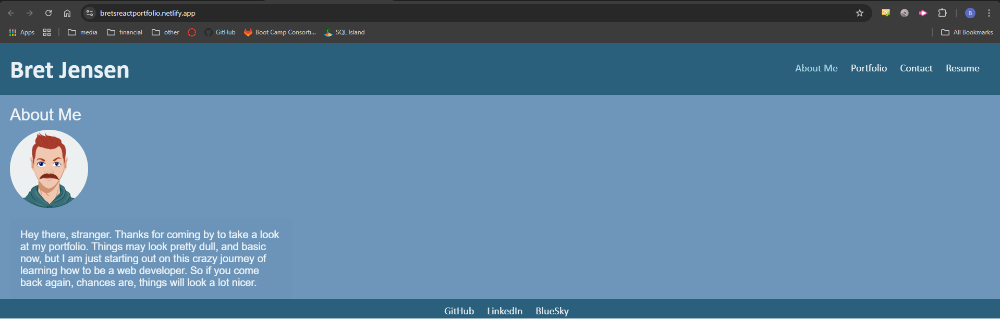

# React Portfolio Project

## Description

this project utilizes React to create a portfolio to showcase skills learned through previous projects and challenges
[deployed website](https://bretsreactportfolio.netlify.app/)

## Table of Contents
- [Installation](#installation)
- [Usage](#usage)
- [Contributing](#contributing)
- [Tests](#tests)
- [Questions](#questions)

## Installation
To install dependencies, run the following command:
npm i
To start program, first run:
npm run dev
   
## Usage

## Contributing 
please create your own branch

## Tests
To run tests, use the following command 
n/a
    
## Questions

If you have any questions, please reach out to me at 
[jensenbret13@gmail.com](mailto:jensenbret13@gmail.com).
GitHub: [bretaj](https://github.com/bretaj)
